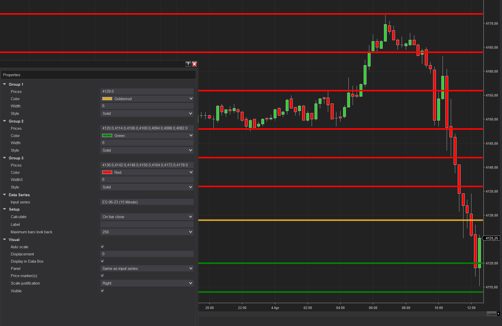

# ArbitraryHorizontalLines indicator

Draws an arbitrary number of horizontal lines on the chart. You may choose between three color groups.

Enter the prices separated by semicolon without any spaces in the input box.

## Installation
1. Download the `ArbitraryHorizontalLines.zip` file 
2. Import it in NinjaTrader: `Tools -> Import -> NinjaScript Add-On...`
3. Add the indicator *ArbitraryHorizontalLines* to the chart

