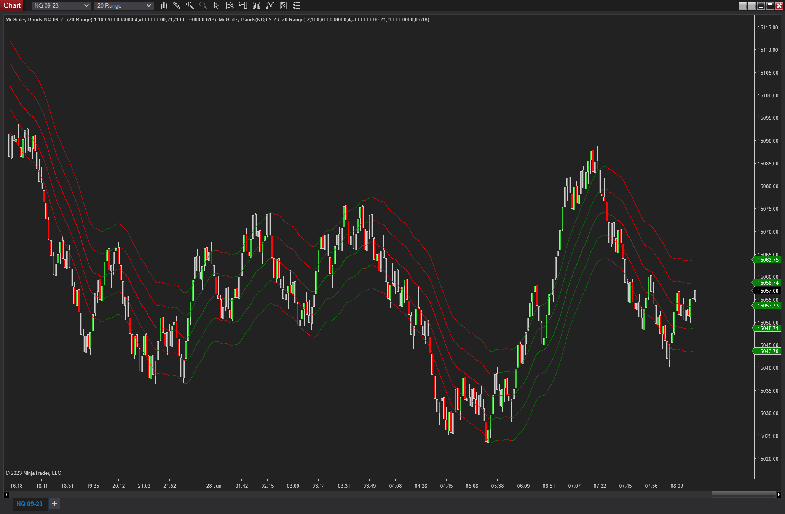

# McGinley Bands

A McGinley moving average with bands based on the ATR.

Add the indicator multiple times with different ATR multiplicators to achieve something similar to the screenshot below.

# Requirements
- NinjaTrader 8

# Installation
- Download the `McGinleyBands.zip` file
- In NinjaTrader go to `Tools -> Import -> NinjaScript Add-On` and select the downloaded ZIP file
- Right click on a chart, select `Indicators...` and find `McGinleyBands` in the list of indicators