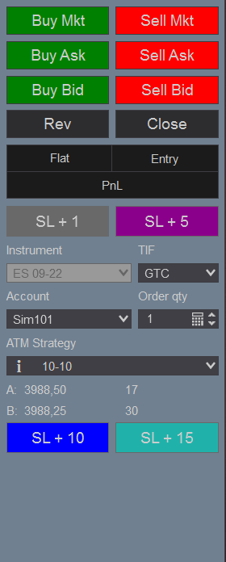

# MoveSLPlusX
NinjaTrader indicator: adds buttons to the chart trader to move the stop loss by a defined number of ticks 

# Requirements
- NinjaTrader 8

# Installation
- Download the `MoveSLPlusX.zip` file
- In NinjaTrader go to `Tools -> Import -> NinjaScript Add-On` and select the downloaded ZIP file
- Right click on a chart, select `Indicators...` and find `Move SL Plus x Ticks` in the list of indicators

# Usage
- You can add up to four buttons
- Each button can have a different color and tick value
- Use [AutoHotkey](https://www.autohotkey.com/) or similar to define shortcuts for the buttons
