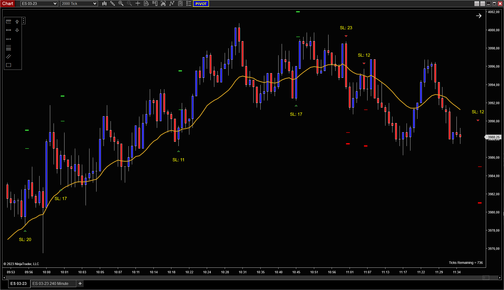

# ProperSignalBar indicator

Highlights a "proper signal bar" as taught by price action trader **Financially Free Trading** on [YouTube](https://www.youtube.com/watch?v=_U493Pl-dGg). Shows the entry, stop loss, scalp, and runner targets on the chart, too.

The indicator is intended to be used on a 2000 tick chart for the ES futures market.

## Signal bar definition
A proper signal shows momentum and meets the following criteria:

- A bullish signal bar has to go at least 1 tick *below* the low of the previous bar. A bearish one has to go at least 1 tick *above* the previous bar.
- A bullish signal bar must finish within 2 ticks of its high. A bearish one within 2 ticks of its low.
- The candle body is minimum 4 ticks in size.
- A bullish signal bar must close above the 21 period EMA. A bearish one below.

## Installation
1. Download the `ProperSignalBar.zip` file 
2. Import it in NinjaTrader: `Tools -> Import -> NinjaScript Add-On...`
3. Add the indicator *Proper Signal Bar* to the chart

## Important to understand
As per **Financially Free Trading**, the two most important things for a good trade are the market context and a proper signal bar. The latter shows momentum in the market. The indicator can help you with  identifiying a good signal bar, but it **cannot** help you to analyze to correct market context. It also does **not** count if the signal bar is a first or second entry. 

## Indicator settings
The indicator comes with a lot of options to identify a good signal bar.

### `BarMaxSizeInTicks`

Max. size of the bar in ticks. The settings allows filtering out too large signal bars, as the stop loss may be too big.

Default: 25

### `BarMinSizeInTicks`

Min. size of the bar in ticks. One wants to avoid small bars as they don't show enough momentum. See also `BarMinBodyInTicks`.

Default: 4

### `BarMinBodyInTicks`

The minimum size of the candle's body in ticks. One want to avoid to small candle bodies as they don't show enough momentum. See also `BarMinSizeInTicks`.

### `BarCloseToHighLowInTicks`

Max. number of ticks the close can be away from the high or low.

Default: 2

### `BarMinTickHigherLower`

Min. number of ticks the current bar must go below or above the previous one, depending on a bullish or bearish bar.

Default: 1

### `BarAwayFromEMAInTicks`

Max. number of ticks the low of a bar can be away from the EMA if we are bullish.
Max. number of ticks the high of a bar can be away from the EMA if we are bearish.

Default: 6

### `EMALength`

Period of the EMA. EMA is not plotted by the indicator. Must be added to the chart seperately.

Default: 21

### `TargetScalpLessTicksThanSL`

The indicator plots the scalp target on the chart with a small green (long) or red (short) line. SL in ticks minus `TargetScalpLessTicksThanSL` = scalp target.

SL calculation: Bar size + 2 ticks. 2 ticks because the SL goes one tick below the bar and you enter one tick above the bar.

Default: 4

### `TargetRunnerTicks`

The indicator plots the runner target on the chart with a big green (long) or red (short) line. 

Default: 24

### `AlertFile`

The indicator can play a sound when a signal bar has formed. Leave empty to disable alerts.

Default: Alert.wav
