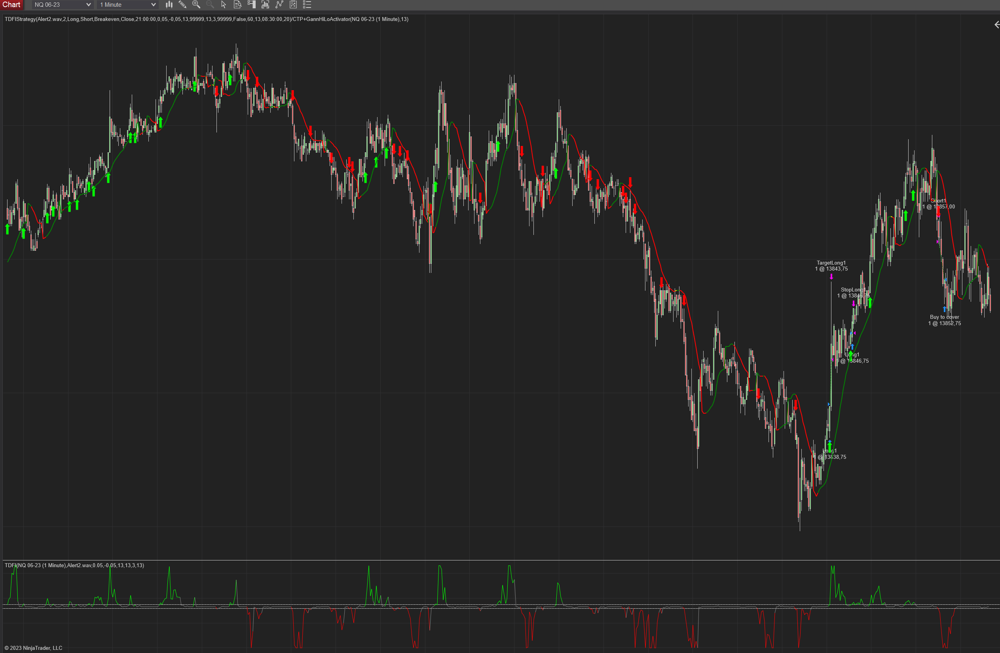

# TDFI

Copy of [this TradingView indicator](https://www.tradingview.com/script/HUpIful1-Trend-Direction-Force-Index-v2-TDFI-wm/).

# Requirements
- NinjaTrader 8

# Installation
- Download the `TDFI.zip` file
- In NinjaTrader go to `Tools -> Import -> NinjaScript Add-On` and select the downloaded ZIP file
- Right click on a chart, select `Indicators...` and find `TDFI` in the list of indicators