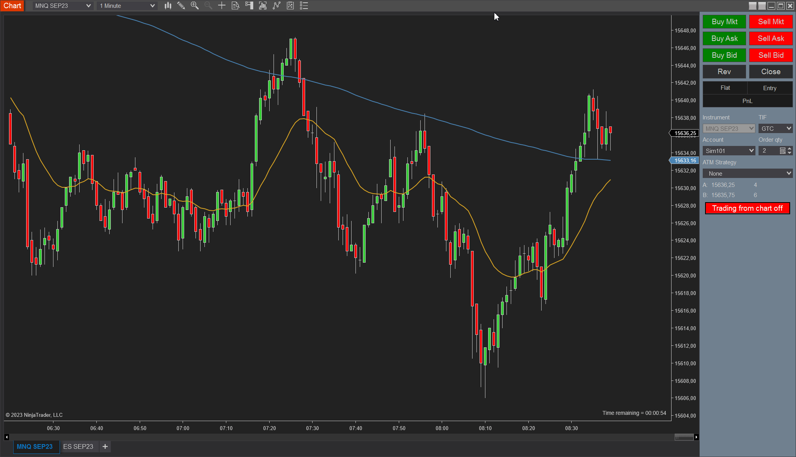
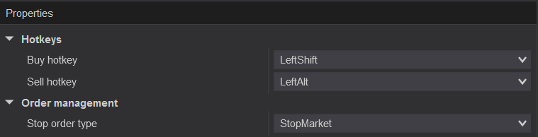

# TradingFromChart indicator
Allows placing orders with a keyboard + mouse combination on a NinjaTrader chart, without having to use NinjaTrader's fiddly right click menu.



# Requirements
- NinjaTrader 8

# Installation
1. Download the `TradingFromChart.zip` file 
2. Import it in NinjaTrader: `Tools -> Import -> NinjaScript Add-On...`
3. Add the indicator *TradingFromChart* to the chart

# Usage
Trading from the chart is disabled by default to protect you from placing orders by mistake. You can turn it on by clicking the red button on the chart trader. Clicking the button again will disable the placing of orders.
## Buy
```
Left shift + left mouse
```
The hotkey is configurable in the indicator settings.
- Creates a buy limit order when below price
- Create a stop buy order when above price. The order type is configurable in the indicator settings.

## Sell
```
Left alt + left mouse
```
The hotkey is configurable in the indicator settings.
- Creates a sell limit order when above price
- Creates a stop sell order when below price. The order type is configurable in the indicator settings.

## Account and ATM
The indicator automatically uses the account and ATM you have set in chart trader.

# Indicator settings


## Hotkeys
### `Buy hotkey`
Hotkey for buy orders

Default: LeftShift
### `Sell hotkey`
Hotkey for sell orders

Default: RightShift
## Order management
### `Stop order type`
Select if you want to place stop market or stop limit orders

Default: StopMarket

# Credits
Based on this NinjaTrader [support forum post by Mindset](https://ninjatrader.com/support/forum/forum/suggestions-and-feedback/suggestions-and-feedback-aa/1145221-chart-trading-from-charts-with-one-click?p=1206610#post1206610)
